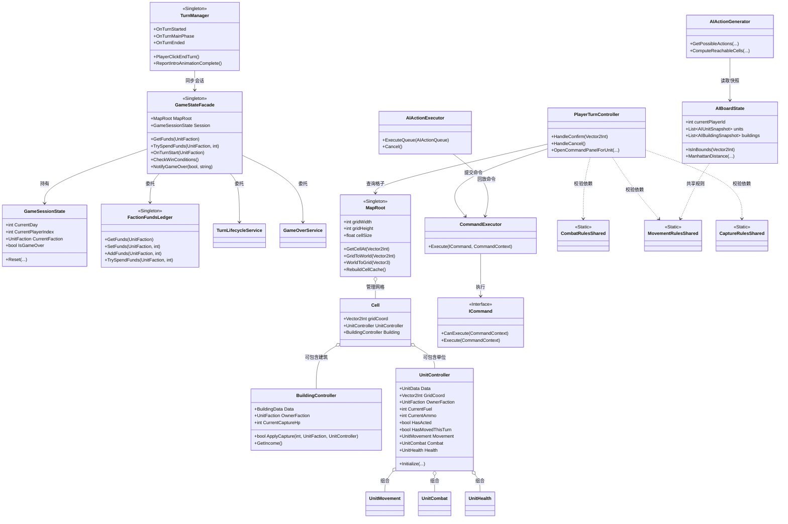

# Operation Marigold

使用Unity开发的类《高级战争》回合制战棋项目，核心聚焦于运行时玩法层与AI模拟层共享同一套规则逻辑，并通过门面、事件驱动、ScriptableObject数据配置与组件化单位架构，构建出可扩展的网格回合系统。

---

## 🎮 玩法介绍 与 部分游戏画面演示 （加载 GIF 可能会比较耗时间）

玩家在方格地图上操作不同阵营的部队进行移动、攻击、占领、补给、装载与投放，围绕总部争夺、工厂造兵与资金运营展开回合制对抗。核心循环包含：回合开始收取建筑收入并刷新己方单位状态、选择单位规划移动与指令、利用地形和兵种克制进行交战、通过步兵持续占领建筑扩大优势，最终击破或夺取敌方关键据点。项目当前还集成了AI行动生成、模拟与执行链路，可在相同规则下驱动非玩家阵营完成完整回合。

1.显示移动范围与确定移动路径

2.攻击范围与攻击指令

3.单位的装载、卸载

4.单位的补给命令

5.单位的占领建筑物命令

6.工厂可生产单位

7.实时战报系统（虚拟滑动列表）

8.基于行为树与Minimax的敌人AI

---

## 🔧 技术点

### 架构设计

| 技术点 | 实现方案 | 达成效果 |
|--------|----------|----------|
| **只读视图接口体系** | 在`Rules/Core`中抽象`ICellReadView`、`IUnitReadView`、`IBuildingReadView`、`IGridReadView`四类只读接口；运行时由`Cell`/`UnitController`/`BuildingController`/`MapRoot`实现，AI侧由`AIBoardState`及快照结构实现 | 同一套规则代码可同时服务Unity场景与AI模拟，避免运行时与搜索层维护两份逻辑 |
| **ScriptableObject数据驱动** | 使用`UnitData`、`BuildingData`、`FactoryBuildCatalogSO`等配置单位属性、建筑收入、总部属性、工厂可生产目录与武器伤害矩阵 | 策划可直接在Inspector中调整兵种、建筑和生产参数，运行时代码无需硬编码具体数值 |
| **门面模式聚合核心服务** | 通过`GameStateFacade`统一暴露地图、资金、会话状态、回合开始处理与胜负查询，底层再委托`GameFundsService`、`TurnLifecycleService`、`GameOverService`等服务 | UI层、命令层与系统层只需面向单一入口，减少横向依赖与服务感知成本 |
| **回合事件驱动** | `TurnManager`负责推进Day / Player / Phase，并通过`OnTurnStarted`、`OnTurnMainPhase`、`OnTurnEnded`、`OnTurnIntroAnimationComplete`等静态事件广播状态 | UI、表现层、单位重置与AI控制彼此解耦，回合流程扩展时不需要大量直接引用 |

### 核心系统实现

| 技术点 | 实现方案 | 达成效果 |
|--------|----------|----------|
| **组件化单位能力架构** | `UnitController`只作为统一门面，具体能力分散在`UnitMovement`、`UnitCombat`、`UnitHealth`及占领/补给/运输相关组件中，按Prefab挂载组合 | 步兵、坦克、运输车等单位能力可以按需组合，职责清晰，便于扩展与调试 |
| **BFS + A*双寻路分工** | 可达域预览使用BFS生成移动范围，实际移动路径使用A*求最优路线，并共享移动类型与地形消耗规则 | 高亮响应足够快，实际行军路径可控且最优，同时保证玩家与AI移动判定一致 |
| **共享规则层** | 在`Rules/`目录中以`CombatRulesShared`、`MovementRulesShared`、`CaptureRulesShared`、`SupplyRulesShared`、`TransportRulesShared`、`TurnEconomyRulesShared`等纯静态规则类承载业务逻辑 | 战斗、占领、补给、运输、收入与修理等规则只写一次，玩家操作与AI推演不会分叉 |
| **命令式操作执行链** | 玩家与AI行为统一抽象为`MoveCommand`、`AttackCommand`、`CaptureCommand`、`ProduceCommand`等命令，再由`CommandExecutor`执行 | 交互流程更清晰，命令可复用到UI、输入、AI执行器多个入口，方便扩展新操作 |
| **AI动作生成与现实执行分离** | `AIActionGenerator`在快照棋盘上基于Minimax搜索动作，`AIPlanTranslator`与`AIActionExecutor`再将计划翻译并落实到真实场景对象 | AI既能在纯数据层高效思考，又能在运行时平滑执行移动、攻击、占领、生产等行为 |
| **网格与建筑状态管理** | `MapRoot`维护`Vector2Int -> Cell`缓存实现O(1)取格；`BuildingController`持有建筑所有权、占领进度、工厂是否已出兵等运行时状态 | 地图查询稳定高效，建筑收入、占领推进与工厂回合限制具备明确状态边界 |

### UI与回合表现

| 技术点 | 实现方案 | 达成效果 |
|--------|----------|----------|
| **指令面板与菜单导航** | `CommandPanelController`结合`VerticalMenuNavigator`、`MenuCursorFollower`构建命令菜单，统一承接攻击、占领、补给、等待等操作入口 | 玩家单位移动后可快速进入可执行指令选择，菜单导航行为一致且易于维护 |
| **工厂生产面板** | `FactoryPanelManager`结合`FactoryBuildCatalogSO`和资金系统展示当前工厂可生产单位，并联动扣费与出生流程 | 建筑经济循环完整闭合，工厂生产和阵营资金约束形成标准战棋运营节奏 |
| **战斗信息悬浮预览** | `AttackInfoHoverPreviewController`与`AttackInfoView`在选定攻击目标时展示交战结果预估信息 | 玩家可以在确认攻击前了解预期伤害与风险，降低试错成本 |
| **胜利与回合信息展示** | `VictoryUIController`、`DayInfoPanelController`等组件监听回合与终局事件更新UI | 回合切换、终局判定与表现层同步明确，逻辑与展示职责分离 |

---

## 🏗️ 核心架构设计

